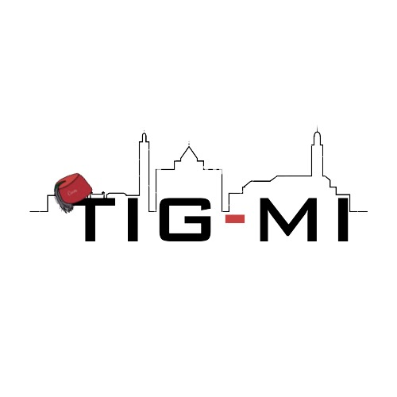
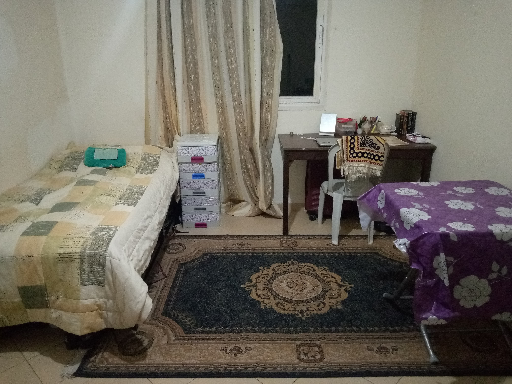
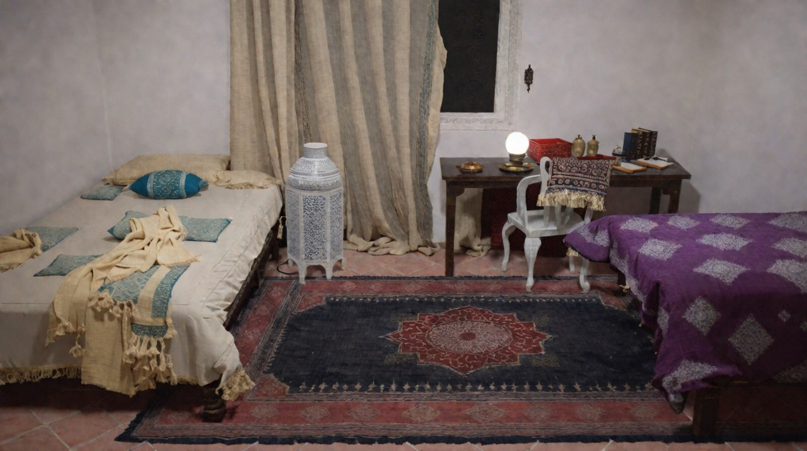
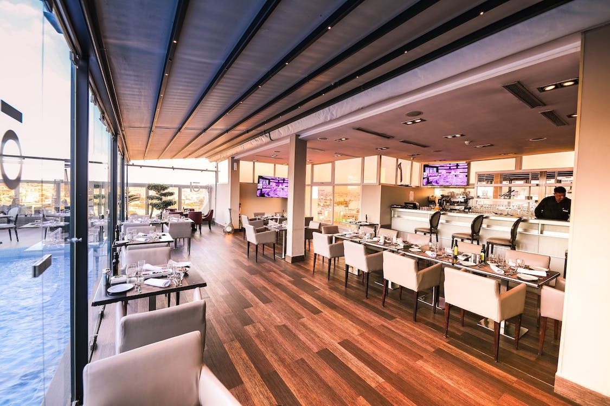
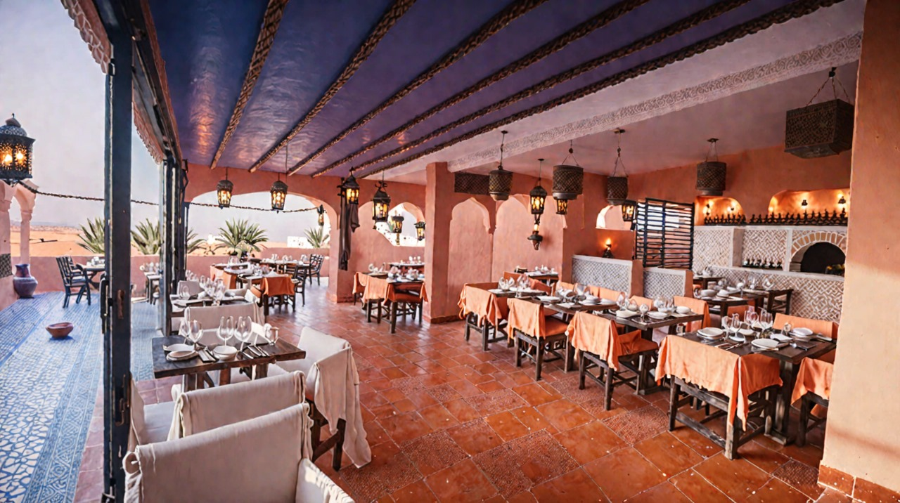
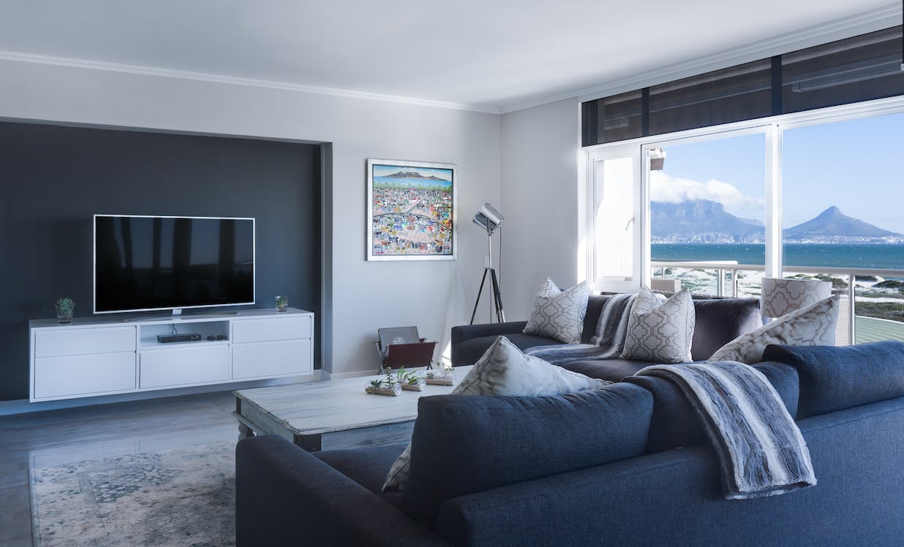
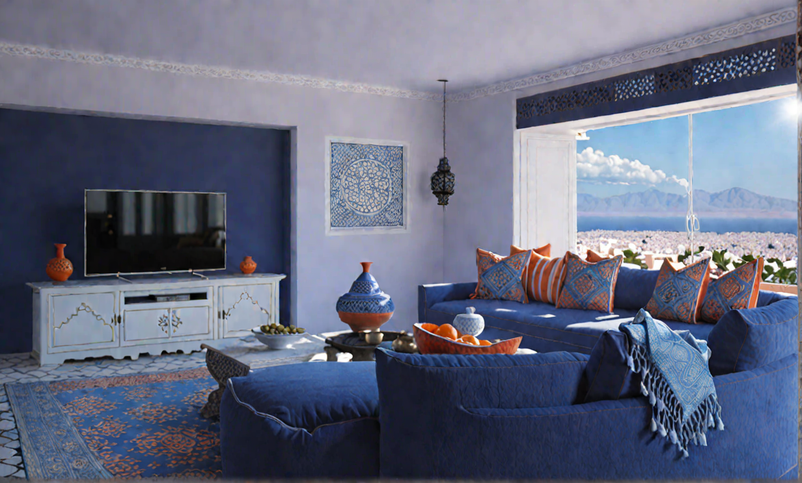
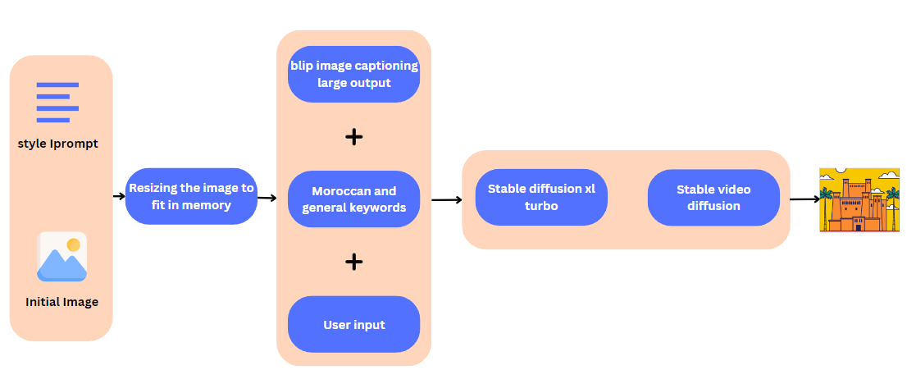
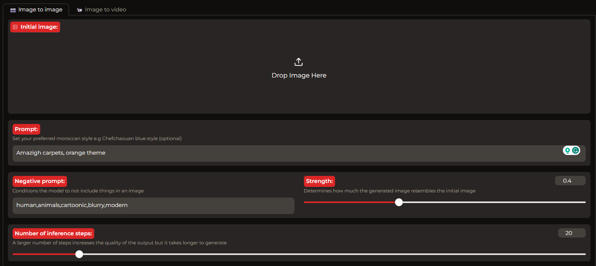

# genAI Hackathon-2023
Firstly, we want to Thank Morocco Ai 2023 for the one week AI hackathon.

<div style="display:flex;">
  

</div>

<div style="display: flex; align-items: center;">
  
  <p>Welcome to our AI-powered generative interior design project Tig-mi, where we explore the beauty of Moroccan culture through innovative AI techniques!</p>
  <!--  -->
</div>

<div style="display:flex;">
  

</div>
 
## 👋 Introduction 

As a demonstration we put in 3 different images:
* The first one is Ihssane's room.
* The second one is a modern european restaurant.
* The third one is a boring room which we will make it more interesting.
 in our code to generate the same room with an added moroccan touch.
<div style="display:flex;">
  
   
</div>
<div style="display:flex;">
  
   
</div>
<div style="display:flex;">
  
   
</div>
<br>
Our AI-powered generative interior design is an exciting fusion of traditional Moroccan aesthetics and modern technological innovation. By leveraging the power of AI, we are able to create designs that seamlessly integrate intricate Moroccan patterns, vibrant colors, and luxurious textures, all while maintaining a strong focus on functionality and practicality.

## 📝 Description



Our project consists of 5 main steps:
* **[Salesforce/blip-image-captioning-large](https://huggingface.co/Salesforce/blip-image-captioning-large):** Image captioning model generates a description of the image.
* Prompt engineering combines the generated description with Moroccan keywords and user style preferences.
* Users can further customize content through input.
* **[stabilityai/sdxl-turbo](https://huggingface.co/stabilityai/sdxl-turbo):** Model generates a new image (Img2Img task) incorporating original features, custom elements, and enriched description.
* **[stability-ai/stable-video-diffusion](https://replicate.com/stability-ai/stable-video-diffusion):** Generated image is used in a specialized video creation model (Img2Vid task).




## 🚀 Installation 

To install the required packages, run the following command:

```bash
pip install -r requirements.txt
```

## 💻 Usage

To run the project, run the following command:

```bash
python main.py
```


## 👨‍💻 Team Members 

* [Wassim EL BAKKOURI](https://www.linkedin.com/in/wassim-elbakkouri/)
* [Ihssane Aoune](https://www.linkedin.com/in/ihssane-aoune-a911a9231/)
* [Fatima Zahra Zeghli](https://www.linkedin.com/in/fatima-zahra-zeghli-2b3715216/)
 
 
