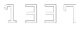
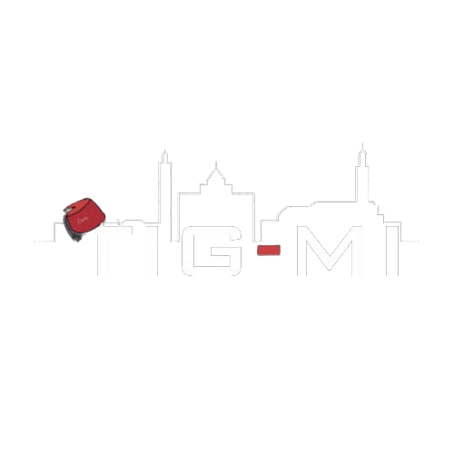
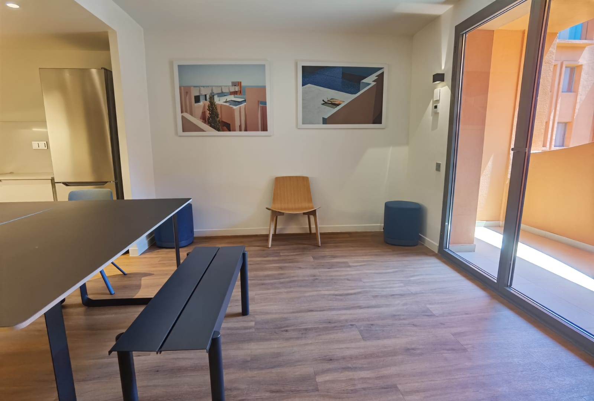
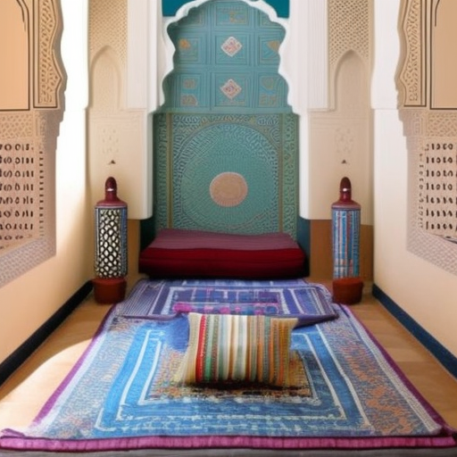
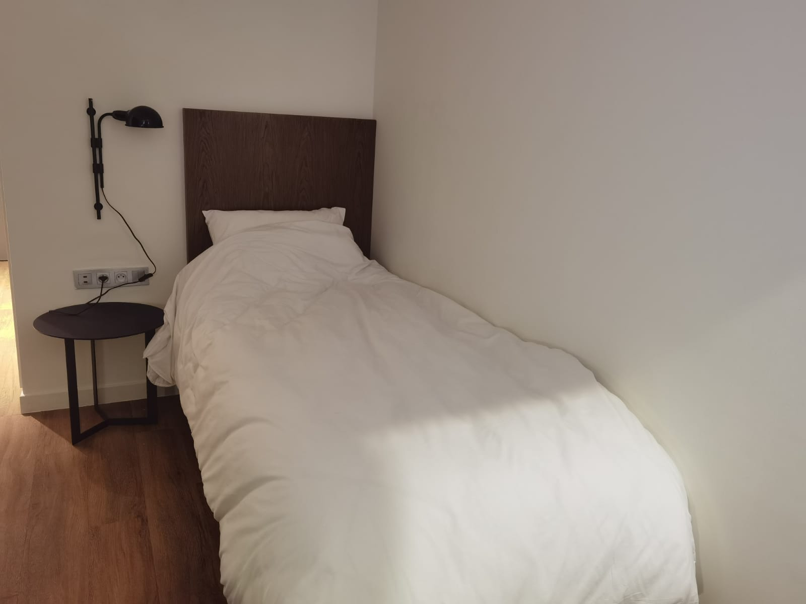
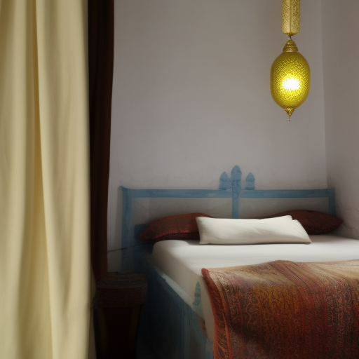
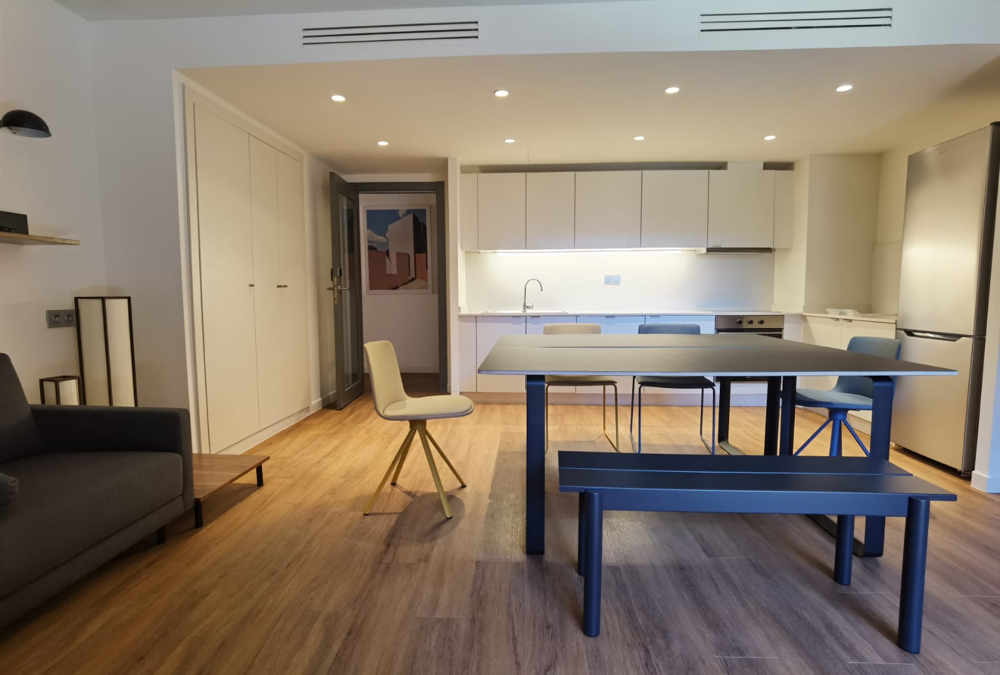
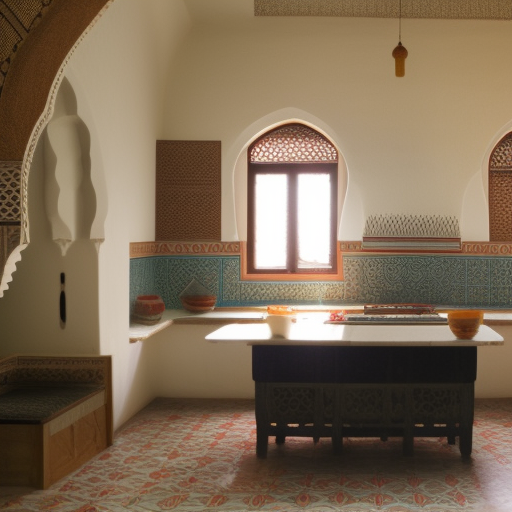
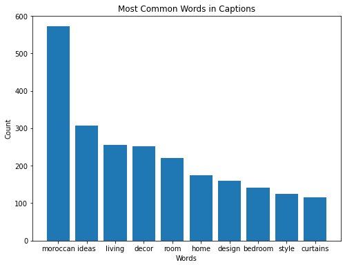
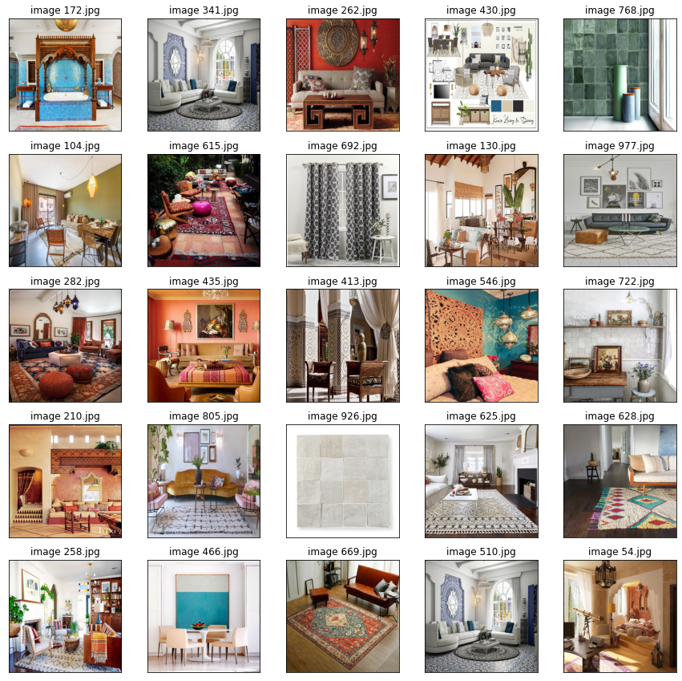

# Hackathon-AI-2023
Firstly, we want to Thank think AI Morocco 2023 for the 3-days AI hackathon co-hosted by 1337AI and Math&amp;Maroc.

<div style="display:flex;">
  
   
</div>

<div style="display: flex; align-items: center;">
  
  <p>Welcome to our AI-powered generative interior design project Tig-mi, where we explore the beauty of Moroccan culture through innovative AI techniques!</p>
  
</div>
 

As a demonstration we put in 3 images from dormitories of UM6P in our code to generate the same room with an added moroccan touch.
<div style="display:flex;">
  
   
</div>
<div style="display:flex;">
  
   
</div>
<div style="display:flex;">
  
   
</div>
Our AI-powered generative interior design is an exciting fusion of traditional Moroccan aesthetics and modern technological innovation. By leveraging the power of AI, we are able to create designs that seamlessly integrate intricate Moroccan patterns, vibrant colors, and luxurious textures, all while maintaining a strong focus on functionality and practicality.

Our project consists of three main processes: data scraping, preprocessing, and diffusion 1.5. Using techniques such as data cleaning and normalization. Finally, we utilize the cutting-edge diffusion 1.5 algorithm to generate stunning, culturally-inspired interior designs.


<h2>1- Scraping</h2>
The first axis of the project involved scraping 45 images from each of the 23 queries related to Moroccan interior design, resulting in a total of 1035 images. For each image, a corresponding img {count}.txt file was created to store the title of the image. The data was then split into two files: Bs4_Images and captions, which were used in the preprocessing step.

```python
Query =  ['Moroccan room design ideas',
    'Moroccan bedroom design ideas',
    'Living room decor ideas with Moroccan touch',
    'Moroccan style bathroom ideas',
    'How to decorate a room in Moroccan style',
    'Moroccan inspired living room ideas',
    'Moroccan decor ideas for small spaces',
    'Moroccan style furniture ideas',
    'Moroccan interior design tips',
    'Moroccan color scheme ideas for rooms',
    'DIY Moroccan room decor ideas',
    'Moroccan lighting ideas for rooms',
    'How to create a Moroccan-inspired outdoor space',
    'Moroccan rugs for rooms',
    'Moroccan style curtains and drapes',
    'Moroccan zellige tile design ideas', 
    'Beni Ourain rug decor ideas', 
    'Moroccan leather pouf design ideas', 
    'Moroccan brass lanterns for decor', 
    'Moroccan ceramic bowl decor ideas', 
    'Moroccan wood carving design ideas', 
    'Moroccan textile patterns for decor', 
    'Moroccan wrought iron furniture design ideas']
 ```   

 
<h2> 2- Preprocessing </h2>
 For a better read into our data we do some basic visualization of character count and word frequency to get an idea on the bias of the text generator.
 <div style="display:flex;">
  
   
</div>
<div style="display:flex;">
  </div>
 Removing punctuations and numbers for textual captions also resizing images to a more unified and standard size 512*512 for a better model accuracy.


<h2> 3- Dreambooth 1.5</h2>
The second axis of the project involved utilizing the cutting-edge diffusion 1.5 algorithm, also known as Dreambooth 1.5, to generate culturally-inspired interior designs. This algorithm is capable of generating high-quality, diverse images while maintaining the structure and style of the input data. By leveraging this powerful algorithm, we were able to create designs that seamlessly integrate intricate Moroccan patterns, vibrant colors, and luxurious textures.

<h2>  4- FineTuning with Stable diffusion</h2>
The third axis of the project involved fine-tuning the Dreambooth 1.5 model with a stable diffusion process to further improve the quality of the generated images. This process involves gradually increasing the level of noise in the input data, which helps to smooth out any inconsistencies or artifacts in the generated images.

<h2> 5- Model Training </h2>
The final axis of the project involved training the model on the preprocessed data to learn the patterns and styles of Moroccan interior design. By training the model on a large and diverse dataset, we were able to create a highly accurate and robust model that is capable of generating high-quality interior designs that are faithful to the Moroccan aesthetic.

<h3>Compiled model</h3>
[click here](https://drive.google.com/file/d/1zzWpIT2CQk-xPUw3J9-UJyRQRyZccxMt/view?usp=sharing)
 
 <h2> 6 - presentation link </h2>
[click here](https://www.canva.com/design/DAFiJs2Lu6s/39Iawa2t26QQ116_zZxnJA/edit?utm_content=DAFiJs2Lu6s&utm_campaign=designshare&utm_medium=link2&utm_source=sharebutton)
 
 <h2> Tig-mi visioned website</h2>
 


 

 
 
 
 
 
